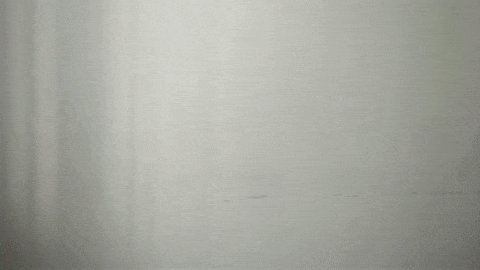
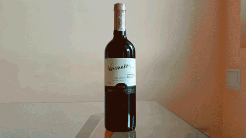

# Rating system using computer vision

## Installation

`pip3 install rateme`

## Introduction

RateMe is a neural network that allows you to recognize gestures of thumb up and thumb down.
The algorithm can be embedded in your project and automate the process of evaluation of something or someone.



For example, using Rate Me you can:

+ Rate music on the YouTube Music service, when you are uncomfortable with clicking buttons

    

+ Count the votes in a beauty contest to determine the winner

    

+ Rate drinks and meals during their tasting

    

## Technical part

### Dependencies

`opencv-contrib-python`, `numpy`

`matplotlib`, `jupyter` for jupyter-notebook

```bash
pip3 install opencv-contrib-python numpy
```

### Usage

Open `Test_RateMe.ipynb` to test RateMe on example images 
(for that you need to start `jupyter-notebook`, it will open window in your browser, where you need to select `Test_RateMe.ipynb`).

For example of realtime detection run `detect_on_webcam.py`.

Minimal working example:

```python
import cv2
from rateme.utils import RateMe

net = RateMe()
img = cv2.imread('test_imgs/like.jpg')
label = net.predict(img)
```

### Description

RateMe is based on [tiny-YOLOv3](https://pjreddie.com/darknet/yolo/) architecture. 

It's accuracy of thumb up/down gesture recognition is calculated as mean average precision (mAP@0.25) = 0.851941, or 85.19%; average IoU = 73.89%

The neural network has been trained on ~3K images (taken from different angles photos of people showing their thumbs or not).
Images were labeled using the [labelImg](https://github.com/tzutalin/labelImg) program.

Class labels: 0 -- "Like (thumb up)", 1 -- "Dislike (thumb down)"

### Speed

Full pipeline speed is 6-7 FPS on Intel(R) Core(TM) i5-4300M CPU @ 2.60GHz.

~100ms on frame grabbing

~100ms on neural network inference
